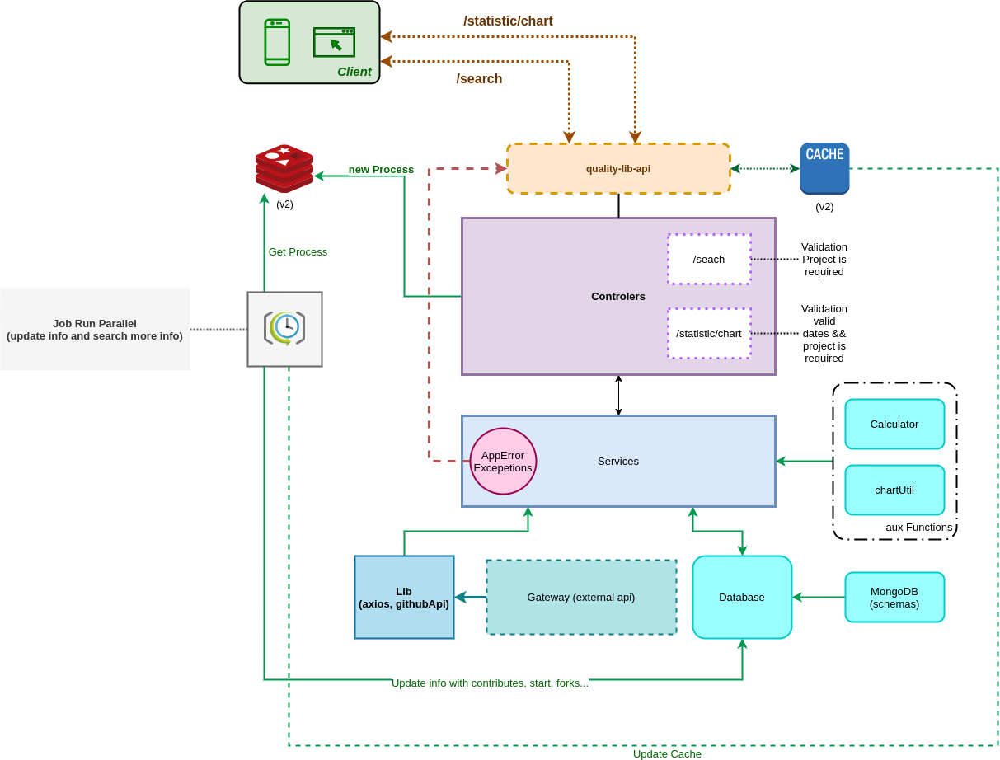

## About this project

*[click here to Portuguese Version](/readme/portugues.md)*

### MVP
> This MVP tool part in a challenge delivered and made to monitor and mesure projects(libs) stored in github.
>
> I used the github api *https://developer.github.com/v3/* as base for searches and integrations.
>
> This project has two endpoints:
> - One of them is used to make the search by name (ex: react), returning the number of opened issues, the avg in days and the standard deviation in days.
> - The second one is used to return a list [x: date, y=number of issues] so the linear chart could be created based on the project selected on front.
>
> ### Search by name, ex:
>
>```json
>{
>  "name": "angular",
>  "fullName": "angular/angular",
>  "openIssues": 3060,
>  "averageDays": 725.1477124183007,
>  "standardDeviation": 25.342038211602375,
>  "items": [{
>      "differenceDays": 0,
>      "created_at": "2020-11-01T00:00:00.000Z",
>      "year": 2020,
>      "month": 11,
>      "issueId": 734426006
>    }, ...]
>```
> ### Create linear chart, ex:
>```json
>{
>   [
>     {
>       "x": "2014",
>       "y": 1
>     },
>     {
>       "x": "2015",
>       "y": 47
>     },
>       ...
>   ]
>}
>```
> To further information about endpoints [click here](#endpointUS).

### Architecture:

> This MVP was planned to have a simple architecture with the matter of reaching the delivery on time, however using the good software development practices.

> Exemple:
> - Very loosely coupled between components.
> - Use of isolated functions with a single responsibility.
> - Development driven to interfaces.
> - Unit tests in services to validate rules.
> - (*Future feature*) Use of cache to improve the performance of requests (Redis).
> - (*Future feature*) Use of queues service to start a job to create and update information in database. libs: (Bull or bee-queue)

>
> #### Structure of directories:
>```sh
>src
>│
>└──── app
>│       └───controllers
>│       └───model
>│       └───services
>│       └───schemas
>│       └───utils
>│       └───error
>│       └───infra
>│       │     └──config
>│       │     └──database
>│       │     │     └──interface
>│       │     │     └──stub
>│       │     └──gateway
>│       │           └──interface
>│       └───libs
>│             └──interface
>│             └──stub
>└───jobs
>└───main
>     │└───http
>     │      └───routes
>     │      └───middleware
>     app.js
>     server.js
>```
>
>#### Architecture Diagram:
> 

### Data Base:
> It was used the mongoDb on this MVP because of it is simple to work, flexible to manipulate and save github data.
>
>*At first I thought in using Postgres DB however it could take a long time to model and create the migrations.*

### Libs used:
>   **Typescript:**
>My motivation in using typescript was to facilitate my understanding and help me to be more productive.
>
> **Axios:**
> Used because there is a strong community to maintain the library and it has the possibility to use the request such in HTTP as in XMLRequest (soap).
>
> **date-fns:**
> Good documentation, good examples, easy reading and easy understanding.

### <a id='endpointUS' > Endpoints </a>

    - To this MVP there are two endpoints:
    - baseURL:(http://localhost:3005)

|Method| URL| Description | Authentication |
|---- |---- | ---------|------ |
|POST |baseURL/search| Obtain information about any project in github | N |
|GET |baseURL/statistic/chart| Obtain data to create the linear chart | N |

Exemples:
 ### Search
> ```sh
>  curl -d '{"project":"angular"}' -H "Content-Type: application/json" -X POST http://localhost:3005/search
>```
 ### Statistics *Along time*:
> ```sh
>  curl GET http://localhost:3005/statistic/chart?project=angular
>```
or
 ### Statistics *day over day*:
> ```sh
>  curl GET http://localhost:3005/statistic/chart?project=angular&dateStart=2020-09-01&dateEnd=2020-10-31
>```

### Executing the Project (env: Local)

> First: You need to create a file .env following the exemple (.env.example). You can see it in root dir in this project.
> Second: You need to create a github token. If you don't know how to create it, [click here](https://docs.github.com/pt/free-pro-team@latest/github/authenticating-to-github/creating-a-personal-access-token).
>
> To execute this project, you need to clone or download it.
> Go to the directory with the files and execute the commands:
>```sh
> $ yarn
> $ docker-compose up -d
>```
>Ready! Now the project is running locally

### Executing only the tests

> First: You need to create a file .env following the exemple (.env.example). You can see it in root dir in this project.
> Second: You need to create a github token. If you don't know how to create it, [click here](https://docs.github.com/pt/free-pro-team@latest/github/authenticating-to-github/creating-a-personal-access-token).
>
> To execute this project, you need to clone or download it.
> Go to the directory with the files and execute the commands:
>```sh
> $ yarn
> $ yarn test ou npm test
>```
> The terminal will show the test execution. At the end, it will generate the feedback of execution and a directory named "coverage" with the index.html.

### Deploy:

> To generate a build to this project, execute the commands:
>```sh
> $ yarn
> $ yarn build or npm build
>```
> Ready! The javascript files will be created in this directory: "/dist".


