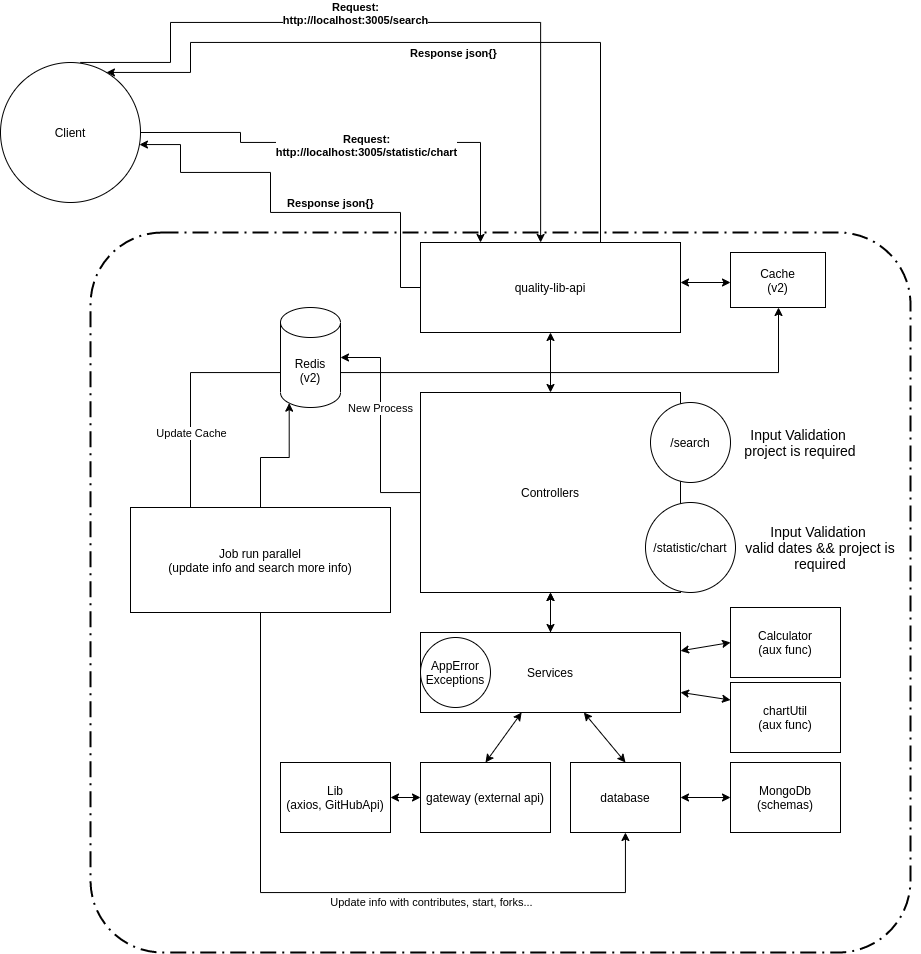

## Sobre este Projeto

### MVP
> Este MVP fez parte de um desafio lançado e realizado para monitorar e medir projetos (libs) armazenados no github.
>
> Foi utilizada a api disponibilizada do próprio gitHub *https://developer.github.com/v3/* como base para as buscas e integrações.
>
> Este projeto possui dois endpoints:
> - Um que será utilizado para realizar a busca pelo nome (ex: react), retornando a quantidade de issues abertas, a média em dias e o desvio padrão em dias.
> - O segundo retornará uma lista [x: data,y= quantidade de issues] para que um gráfico seja montado baseado no projeto selecionado no front.
>
> ### Busca pelo Nome, ex:
>
>```json
>{
>  "name": "angular",
>  "fullName": "angular/angular",
>  "openIssues": 3060,
>  "averageDays": 725.1477124183007,
>  "standardDeviation": 25.342038211602375,
>  "items": [{
>      "differenceDays": 0,
>      "created_at": "2020-11-01T00:00:00.000Z",
>      "year": 2020,
>      "month": 11,
>      "issueId": 734426006
>    }, ...]
>```
> ### Montar gráfico tipo linha, ex:
>```json
>{
>   [
>     {
>       "x": "2014",
>       "y": 1
>     },
>     {
>       "x": "2015",
>       "y": 47
>     },
>       ...
>   ]
>}
>```
> Para maiores detalhes sobre os endpoints [clique aqui](#endpointBr).

### Arquitetura:

> Para este mvp foi pensado em ter uma arquitetura simples com o propósito de atingir a entrega dentro do prazo porém sem deixar de lado algumas boas práticas.
> Tais como:
> - Desacoplamento entre componentes.
> - Utilização de funções auxiliares isoladas com uma única responsabilidade.
> - Utilização de interfaces.
> - Testes realizados nos serviços para validar as regras de negócio.
> - (*Futura implementação*) Utilização de Cache, para aumentar o tempo de respostas nas requisições (Redis).
> - (*Futura implementação*) Uso de um serviço de Fila para alimentar o database com informações a serem utilizadas no futuro dentro do mvp. libs: (Bull ou bee-queue)
>
> #### Estrutura de pastas do projeto:
>```sh
>src
>│
>└──── app
>│       └───controllers
>│       └───model
>│       └───services
>│       └───schemas
>│       └───utils
>│       └───error
>│       └───infra
>│       │     └──config
>│       │     └──database
>│       │     │     └──interface
>│       │     │     └──stub
>│       │     └──gateway
>│       │           └──interface
>│       └───libs
>│             └──interface
>│             └──stub
>└───jobs
>└───main
>     │└───http
>     │      └───routes
>     │      └───middleware
>     app.js
>     server.js
>```
>
>#### Diagrama com a Arquitetura:
> 

### Banco de Dados:
> Para este mvp foi utilizado o mongoDb pelo fato dele ser simples de se trabalhar com os dados que serão retornados pela api do github e pela flexibilidade em poder armazenar tudo em uma única coleção.
>
>*Inicialmente pensei em usar Postgres porém levaria algum tempo para a modelagem e criação das migrations.*

### Libs utilizadas:
>   **Typescript:**
>Minha maior motivação pelo uso do typescript foi pelo fato de facilitar o meu
>entendimento e me ajudar a ser mais produtivo.
>
> **Axios:**
> Utilizado pelo fato de ter uma comunidade forte em volta dele que mantém a biblioteca e pelo fato de poder usar tanto em requisições http como XMLRequest (soap).
>
> **data-fns:**
> Utilizada por ter uma documentação boa, fácil leitura e bom entendimento.

### <a id='endpointBr' > Endpoints </a>

    - Para este mvp temos dois endpoints conforme tabela abaixo:
    - baseURL:(http://localhost:3005)

|Metódo| URL| Descrição | Autenticação |
|---- |---- | ---------|------ |
|POST |baseURL/search| Obter informações sobre qualquer projeto no github | N |
|GET |baseURL/statistic/chart| Obter dados para montagem do gráfico de linha | N |

- Exemplo de uso:
 ### Search
> ```sh
>  curl -d '{"project":"angular"}' -H "Content-Type: application/json" -X POST http://localhost:3005/search
>```
 ### Statistics *Along time*:
> ```sh
>  curl GET http://localhost:3005/statistic/chart?project=angular
>```
ou
 ### Statistics *day over day*:
> ```sh
>  curl GET http://localhost:3005/statistic/chart?project=angular&dateStart=2020-09-01&dateEnd=2020-10-31
>```

### Execução do Projeto (ambiente: Local)

> Antes de executar é necessário criar o arquivo .env conforme o arquivo de exemplo (.env.example) e adicionar o token do gitHub. Este token precisa ser criado com sua conta no github. Caso não sabia como gerar [clique aqui](https://docs.github.com/pt/free-pro-team@latest/github/authenticating-to-github/creating-a-personal-access-token) para maiores informações.
>
> Para a execução deste projeto basta realizar o clone ou download.
> Navegar até o diretório com os arquivos e executar os comandos:
>```sh
> $ yarn
> $ docker-compose up -d
>```
>Pronto projeto está rodando localmente.

### Executar apenas os testes

> Antes de executar é necessário criar o arquivo .env conforme o arquivo de exemplo (.env.example) e adicionar o token do gitHub. Este token precisa ser criado com sua conta no github. Caso não sabia como gerar [clique aqui](https://docs.github.com/pt/free-pro-team@latest/github/authenticating-to-github/creating-a-personal-access-token) para maiores informações.
>
> Para a execução dos testes deste projeto basta realizar o clone ou download.
> Navegar até o diretório com os arquivos e executar os comandos:
>```sh
> $ yarn
> $ yarn test ou npm test
>```
> Será apresentado no console a execução dos testes e ao finalizar, além de apresentar um  feedback também será gerado um diretório chamado "coverage" que contém um index.html para verificação.

### Deploy Produção:

>Caso precise gerar um deploy deste projeto para colocar em um servidor, basta executar os comandos abaixo:
>```sh
> $ yarn
> $ yarn build or npm build
>```
> Será realizado o build e criado o diretório "/dist" com os arquivos javascript.


